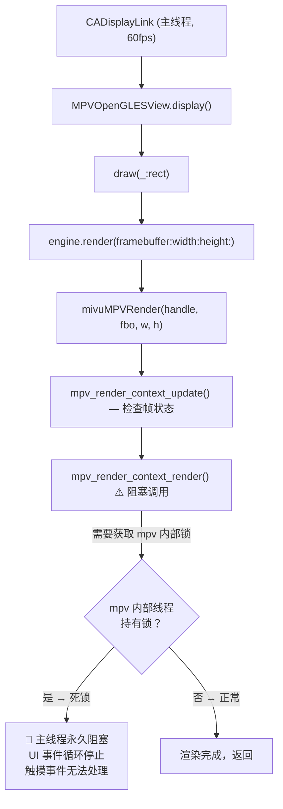
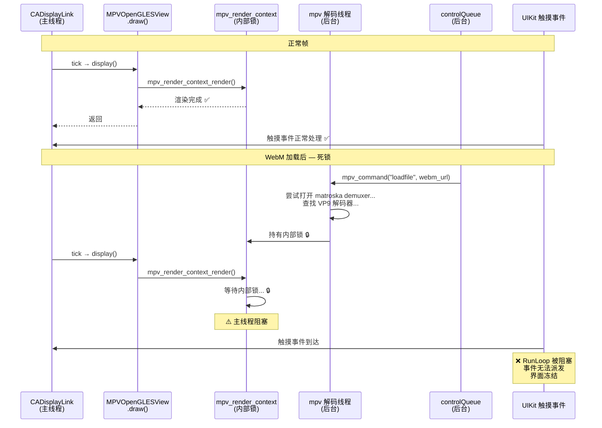

# MPV WebM 播放黑屏 + UI 冻结 — 问题诊断报告（修订版）

> [!IMPORTANT]
> 本报告仅记录分析结论，**未修改任何代码**。

---

## 1. 问题现象

播放测试流 **"MDN Flower WebM 测试片段 (MPV 验证)"** 时：
- 画面**黑屏**
- **界面完全冻结**：所有触摸事件无响应，无法点击退出按钮
- 只能**上滑强制退出 app**
- 没有错误提示

测试 URL：`https://interactive-examples.mdn.mozilla.net/media/cc0-videos/flower.webm`（已验证可访问，返回 `video/webm`，554 KB）

> [!CAUTION]
> 「UI 完全冻结」这个现象说明问题不是简单的播放失败，而是**主线程被阻塞或死锁**。普通的播放失败只会显示错误界面，不会冻结整个 UI。

---

## 2. 路由确认 — WebM 一定走 MPV

[MediaItem.swift](file:///Users/kelvinsze/Projects/Mivu/Sources/MediaCore/MediaItem.swift#L146-L151) 中 WebM 测试项设置了 `containerHint: "webm"`，[PlaybackRouter](file:///Users/kelvinsze/Projects/Mivu/Sources/MediaCore/PlaybackCore/PlaybackRouter.swift#L14) 将其路由到 MPV 引擎。

---

## 3. 根因分析

### 🔴 首要根因：`mpv_render_context_render` 在主线程无条件阻塞调用

这是导致 **UI 完全冻结**的直接原因。

整个调用链在**主线程**上执行，无法被中断：



关键代码在 [MPVBridge.m:272-306](file:///Users/kelvinsze/Projects/Mivu/Sources/MediaCore/PlaybackCore/MPVBridge.m#L272-L306)：

```c
int mivu_mpv_render(MivuMPV *player, int framebuffer, int width, int height) {
    // ...
    // ⚠️ 未检查是否有新帧可用，直接渲染
    player->last_render_update_flags = mpv_render_context_update(player->render_context);
    // ⚠️ 阻塞调用 — 在主线程上执行
    int result = mpv_render_context_render(player->render_context, params);
    // ...
}
```

**两个致命问题叠加：**

#### 问题 A：未检查 `mpv_render_context_update` 返回值

`mpv_render_context_update` 返回标志位，其中 `MPV_RENDER_UPDATE_FRAME` 表示有新帧可渲染。当前代码**忽略了这个返回值**，无论是否有新帧都执行 `mpv_render_context_render`。

正确的模式应该是：

```c
uint64_t flags = mpv_render_context_update(player->render_context);
if (!(flags & MPV_RENDER_UPDATE_FRAME)) {
    return 0;  // 没有新帧，跳过渲染，立即返回
}
int result = mpv_render_context_render(player->render_context, params);
```

#### 问题 B：`mpv_render_context_render` 是阻塞调用

根据 mpv 文档，`mpv_render_context_render` 会**阻塞直到渲染完成**。当 mpv 处于异常内部状态（如找不到 VP9 解码器、解复用器初始化失败），这个调用可能：

1. **与 mpv 内部线程争夺锁** → 死锁
2. **等待不可能到来的解码帧** → 无限阻塞
3. **CPU 密集的软件解码** → 每帧阻塞主线程数十毫秒

因为 [CADisplayLink](file:///Users/kelvinsze/Projects/Mivu/Sources/MediaCore/PlaybackCore/MPVPlayerEngine.swift#L56-L61) 以 `.common` 模式注册在主 RunLoop 上，它与触摸事件共享同一个事件循环：

```swift
displayLink?.add(to: .main, forMode: .common)
```

一旦 `mpv_render_context_render` 在主线程阻塞，**整个 RunLoop 停转**，所有触摸事件排队等待，UI 完全冻结。

---

### 🔴 根因 ②：FFmpeg 构建可能缺少 VP9 解码器和 matroska demuxer

[build-libmpv-ios.sh](file:///Users/kelvinsze/Projects/Mivu/scripts/build-libmpv-ios.sh#L185-L198) 中 FFmpeg 配置使用了 `--disable-autodetect`，但**未显式声明**需要 VP8/VP9/Opus 解码器和 matroska demuxer：

```bash
--disable-autodetect --disable-avdevice \
--enable-network --enable-securetransport \
--enable-protocol=file,http,https,tcp,tls \
--enable-videotoolbox
# ⚠️ 缺少：--enable-decoder=vp8,vp9,opus,vorbis
# ⚠️ 缺少：--enable-demuxer=matroska
```

如果这些组件确实缺失，mpv 加载 WebM 文件后会进入**解码器查找失败**的异常状态，这正是触发根因 ① 死锁的前提条件。

### 🟡 根因 ③：`hwdec=no` 强制纯软件解码

[MPVBridge.m:57](file:///Users/kelvinsze/Projects/Mivu/Sources/MediaCore/PlaybackCore/MPVBridge.m#L57) 设置 `hwdec=no`。即使 VP9 解码器存在，纯软件解码 VP9 在 iOS 上非常慢，每帧可能阻塞主线程 50ms+，造成严重卡顿甚至 watchdog 超时。

### 🟡 根因 ④：Fallback 逻辑无法触发

由于主线程被阻塞，[PlayerService](file:///Users/kelvinsze/Projects/Mivu/Sources/MediaCore/PlayerService.swift#L383-L408) 中的 `handlePlaybackFailure()` fallback 逻辑永远无法执行——它依赖 MainActor 上的事件处理，而 MainActor 已经被 `mpv_render_context_render` 卡死了。

---

## 4. 死锁时序图



---

## 5. 修订结论

| 优先级 | 问题 | 现象 | 位置 |
|--------|------|------|------|
| 🔴 **P0** | `mpv_render_context_render` 在主线程无条件阻塞调用，未检查 `MPV_RENDER_UPDATE_FRAME` | **UI 完全冻结，无法退出** | [MPVBridge.m:291-292](file:///Users/kelvinsze/Projects/Mivu/Sources/MediaCore/PlaybackCore/MPVBridge.m#L291-L292) |
| 🔴 **P0** | CADisplayLink 以 `.common` 模式在主 RunLoop 60fps 驱动渲染 | 主线程无喘息空间 | [MPVPlayerEngine.swift:56-61](file:///Users/kelvinsze/Projects/Mivu/Sources/MediaCore/PlaybackCore/MPVPlayerEngine.swift#L56-L61) |
| 🔴 P0 | FFmpeg 构建可能缺少 VP9 解码器 / matroska demuxer | mpv 进入异常内部状态 | [build-libmpv-ios.sh:185-198](file:///Users/kelvinsze/Projects/Mivu/scripts/build-libmpv-ios.sh#L185-L198) |
| 🟡 P1 | `hwdec=no` 强制软件解码 VP9 | 即使不死锁也会严重卡顿 | [MPVBridge.m:57](file:///Users/kelvinsze/Projects/Mivu/Sources/MediaCore/PlaybackCore/MPVBridge.m#L57) |
| 🟡 P1 | Fallback 逻辑依赖 MainActor，无法在主线程阻塞时触发 | 没有逃生出口 | [PlayerService.swift:383-408](file:///Users/kelvinsze/Projects/Mivu/Sources/MediaCore/PlayerService.swift#L383-L408) |

> [!IMPORTANT]
> 与初版报告的关键区别：**根因从「播放失败」修正为「主线程死锁」**。UI 冻结说明 `mpv_render_context_render` 与 mpv 内部解码线程之间发生了锁竞争，导致主线程 RunLoop 完全停转。

---

## 6. 建议修复方向（供后续实施参考）

> [!TIP]
> 以下仅为建议，本次未做任何代码修改。

### 优先级最高 — 解除主线程阻塞

1. **在 `mivu_mpv_render` 中检查更新标志**：只在 `MPV_RENDER_UPDATE_FRAME` 置位时才调用 `mpv_render_context_render`，否则立即返回

2. **将 `mpv_render_context_render` 移到独立渲染队列**：不在主线程直接调用，改为在专用 GL 线程渲染，完成后将结果同步到主线程显示

3. **给 `mpv_render_context_render` 调用加超时保护**：使用 `dispatch_semaphore_wait` 限制阻塞时间，超时则跳过该帧

### 优先级次高 — 确保解码器可用

4. **确认 FFmpeg 构建产物中的 codec 列表**：在构建日志或 `config.h` 中检查 `HAVE_VP9_DECODER`；如缺失，显式添加 `--enable-decoder=vp8,vp9,opus,vorbis --enable-demuxer=matroska`

### 优先级第三 — 增加容错

5. **在 `mpv_render_context_render` 失败时暂停 CADisplayLink**：避免持续尝试渲染失败的帧

6. **Fallback 逻辑改为不依赖 MainActor**：使用超时机制或独立的 watchdog 检测主线程阻塞

---

## 7. 与初版报告的差异总结

| | 初版结论 | 修订结论 |
|---|---------|---------|
| 现象定义 | 播放失败（黑屏） | 主线程死锁（UI 完全冻结） |
| P0 根因 | FFmpeg 缺少解码器 | `mpv_render_context_render` 主线程阻塞 |
| 触发条件 | 解码器缺失 | 解码器缺失 + 主线程无条件渲染 |
| 修复方向 | 补充 FFmpeg 构建参数 | 先解除主线程渲染阻塞，再补充解码器 |
| Fallback | 可触发但双引擎都失败 | 完全无法触发（主线程已死锁） |
